# QAT-AUTH2-04 — ผลทดสอบ Playwright

> ไฟล์นี้สร้างอัตโนมัติจาก `npm run test:e2e` ห้ามแก้ผลด้วยมือ

## สภาพแวดล้อม

| รายการ       | ค่า                                                         |
| ------------ | ----------------------------------------------------------- |
| Base URL     | `http://127.0.0.1:4202`                                     |
| Browser      | Chromium                                                    |
| ระบบที่ทดสอบ | Angular → Nginx → ASP.NET Core API → PostgreSQL บน OrbStack |

## สรุปผล

| ทั้งหมด | ผ่าน | ไม่ผ่าน | สถานะ |
| ------: | ---: | ------: | ----- |
|      25 |   25 |       0 | PASS  |

## ผลรายกรณี

| Test Case ID         | ชื่อกรณีทดสอบ                                                  | ประเภท     | ผล   | เวลา (ms) | Screenshot                                      |
| -------------------- | -------------------------------------------------------------- | ---------- | ---- | --------: | ----------------------------------------------- |
| TC-AUTH2-E2E-001     | เปิดหน้าสมัครสมาชิกตาม IT 02-2                                 | Functional | PASS |       288 | [เปิดภาพ](screenshots/tc-auth2-e2e-001.png)     |
| TC-AUTH2-E2E-002     | สมัครสมาชิกและกลับหน้าเข้าสู่ระบบ                              | Functional | PASS |       575 | [เปิดภาพ](screenshots/tc-auth2-e2e-002.png)     |
| TC-AUTH2-E2E-003     | เข้าสู่ระบบและแสดงชื่อหลังตรวจ JWT                             | Functional | PASS |       525 | [เปิดภาพ](screenshots/tc-auth2-e2e-003.png)     |
| TC-AUTH2-E2E-004     | ออกจากระบบและลบ token                                          | Functional | PASS |       382 | [เปิดภาพ](screenshots/tc-auth2-e2e-004.png)     |
| TC-AUTH2-CONTENT-001 | ไม่แสดงรหัสข้อสอบ ศัพท์ภายใน หรือรายการนโยบาย Password ค้างไว้ | Content    | PASS |       399 | [เปิดภาพ](screenshots/tc-auth2-content-001.png) |
| TC-AUTH2-VAL-001     | ปฏิเสธฟอร์มเข้าสู่ระบบว่างโดยไม่เรียก API                      | Validation | PASS |       255 | [เปิดภาพ](screenshots/tc-auth2-val-001.png)     |
| TC-AUTH2-VAL-002     | ปฏิเสธรหัสผ่านยืนยันไม่ตรงกัน                                  | Validation | PASS |       304 | [เปิดภาพ](screenshots/tc-auth2-val-002.png)     |
| TC-AUTH2-VAL-003     | ปฏิเสธ Username ซ้ำแบบไม่แยกตัวพิมพ์                           | Validation | PASS |       390 | [เปิดภาพ](screenshots/tc-auth2-val-003.png)     |
| TC-AUTH2-VAL-004     | ปฏิเสธรหัสผ่านที่สั้นกว่าแปดตัวอักษร                           | Validation | PASS |       300 | [เปิดภาพ](screenshots/tc-auth2-val-004.png)     |
| TC-AUTH2-VAL-005     | API สมัครสมาชิกตอบ Problem Details เมื่อ payload ไม่ถูกต้อง    | Validation | PASS |       206 | [เปิดภาพ](screenshots/tc-auth2-val-005.png)     |
| SEC-AUTH2-001        | ปิดบังฟิลด์รหัสผ่านทุกช่อง                                     | Security   | PASS |       253 | [เปิดภาพ](screenshots/sec-auth2-001.png)        |
| SEC-AUTH2-002        | ปฏิเสธ API me เมื่อไม่มี JWT                                   | Security   | PASS |       230 | [เปิดภาพ](screenshots/sec-auth2-002.png)        |
| SEC-AUTH2-006        | ปฏิเสธ JWT ไม่ถูกต้องและแจ้งให้เข้าสู่ระบบใหม่                 | Security   | PASS |       270 | [เปิดภาพ](screenshots/sec-auth2-006.png)        |
| SEC-AUTH2-011        | ปฏิเสธ JWT ที่ถูกดัดแปลง                                       | Security   | PASS |       323 | [เปิดภาพ](screenshots/sec-auth2-011.png)        |
| SEC-AUTH2-003        | ใช้ข้อความกลางเมื่อข้อมูลรับรองผิด                             | Security   | PASS |       447 | [เปิดภาพ](screenshots/sec-auth2-003.png)        |
| SEC-AUTH2-004        | ส่ง security headers ผ่าน Nginx                                | Security   | PASS |       236 | [เปิดภาพ](screenshots/sec-auth2-004.png)        |
| SEC-AUTH2-013        | ไม่เปิดเผยรุ่นของ web server                                   | Security   | PASS |       231 | [เปิดภาพ](screenshots/sec-auth2-013.png)        |
| TC-AUTH2-RESP-001    | ทุกหน้ารองรับ viewport มือถือ                                  | Responsive | PASS |       370 | [เปิดภาพ](screenshots/tc-auth2-resp-001.png)    |
| TC-AUTH2-RESP-002    | การ์ด Login อยู่กึ่งกลางพื้นที่ใต้ส่วนหัว                      | Responsive | PASS |       209 | [เปิดภาพ](screenshots/tc-auth2-resp-002.png)    |
| SEC-AUTH2-007        | ป้องกัน SQL injection ที่ช่อง Username ของ Login               | Security   | PASS |       254 | [เปิดภาพ](screenshots/sec-auth2-007.png)        |
| SEC-AUTH2-008        | ไม่อนุญาต CORS จาก origin ที่ไม่เชื่อถือ                       | Security   | PASS |       200 | [เปิดภาพ](screenshots/sec-auth2-008.png)        |
| SEC-AUTH2-009        | ปฏิเสธ payload ที่เกินขนาดกำหนด                                | Security   | PASS |       206 | [เปิดภาพ](screenshots/sec-auth2-009.png)        |
| SEC-AUTH2-010        | ไม่ cache ผลตอบกลับที่เกี่ยวกับการยืนยันตัวตน                  | Security   | PASS |       271 | [เปิดภาพ](screenshots/sec-auth2-010.png)        |
| SEC-AUTH2-005        | จำกัดอัตราคำขอเข้าสู่ระบบ                                      | Security   | PASS |       274 | [เปิดภาพ](screenshots/sec-auth2-005.png)        |
| SEC-AUTH2-012        | จำกัดอัตราคำขอสมัครสมาชิก                                      | Security   | PASS |       224 | [เปิดภาพ](screenshots/sec-auth2-012.png)        |

## ภาพหลักฐาน

### TC-AUTH2-E2E-001 — เปิดหน้าสมัครสมาชิกตาม IT 02-2

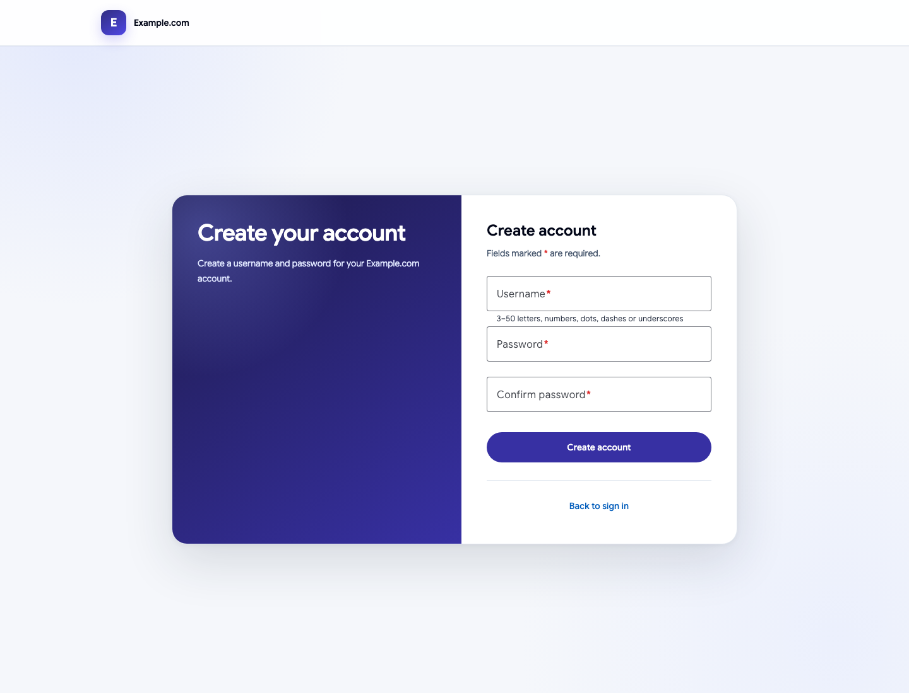

### TC-AUTH2-E2E-002 — สมัครสมาชิกและกลับหน้าเข้าสู่ระบบ

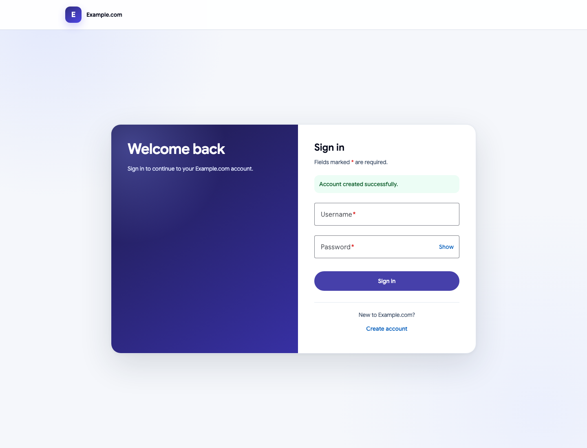

### TC-AUTH2-E2E-003 — เข้าสู่ระบบและแสดงชื่อหลังตรวจ JWT

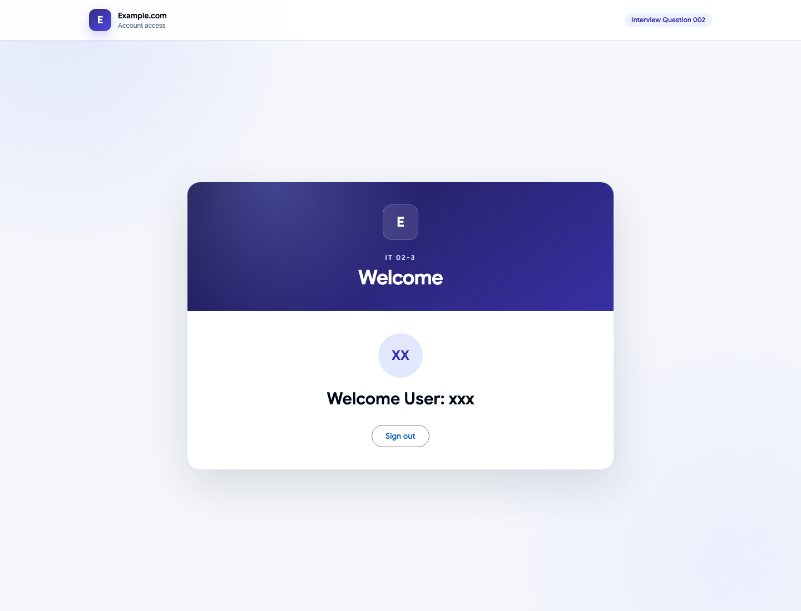

### TC-AUTH2-E2E-004 — ออกจากระบบและลบ token

### TC-AUTH2-CONTENT-001 — ไม่แสดงรหัสข้อสอบ ศัพท์ภายใน หรือรายการนโยบาย Password ค้างไว้

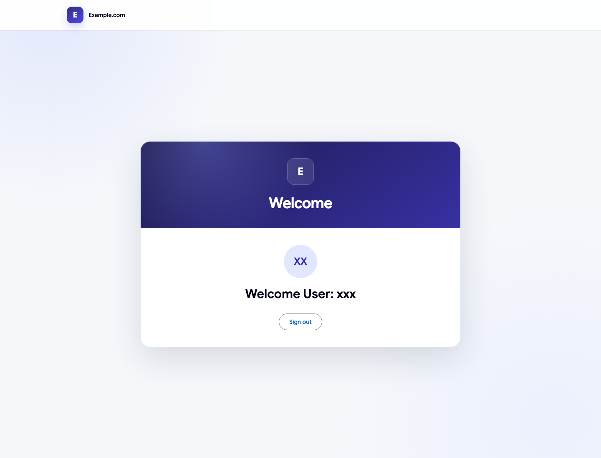

### TC-AUTH2-VAL-001 — ปฏิเสธฟอร์มเข้าสู่ระบบว่างโดยไม่เรียก API

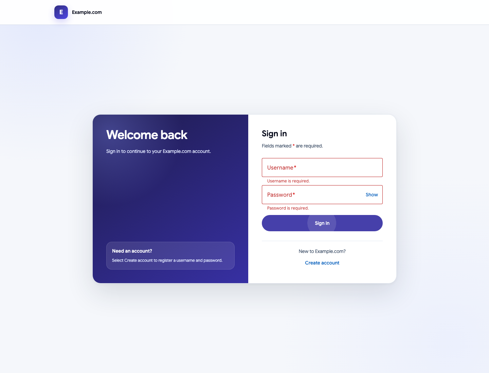

### TC-AUTH2-VAL-002 — ปฏิเสธรหัสผ่านยืนยันไม่ตรงกัน

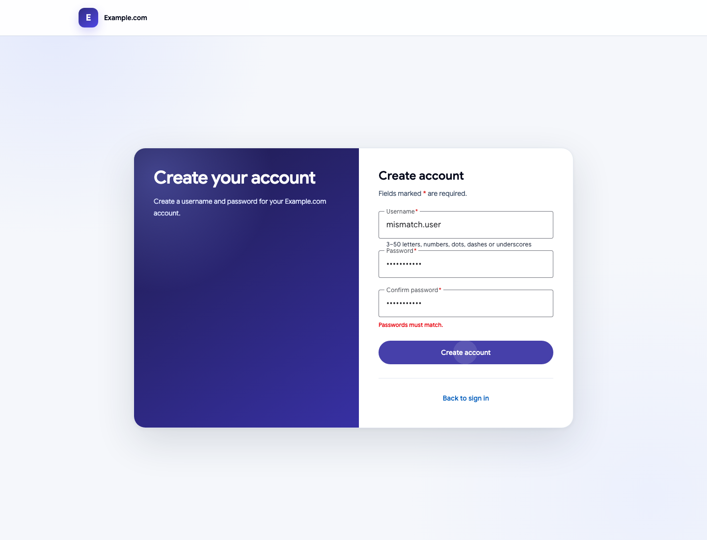

### TC-AUTH2-VAL-003 — ปฏิเสธ Username ซ้ำแบบไม่แยกตัวพิมพ์

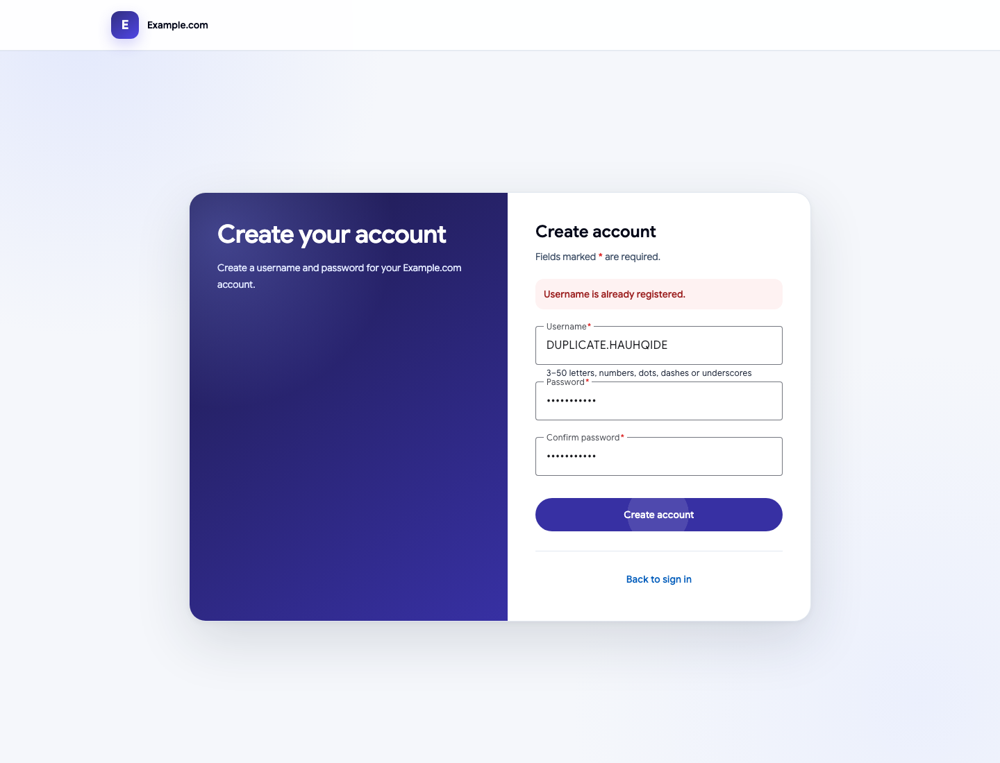

### TC-AUTH2-VAL-004 — ปฏิเสธรหัสผ่านที่สั้นกว่าแปดตัวอักษร

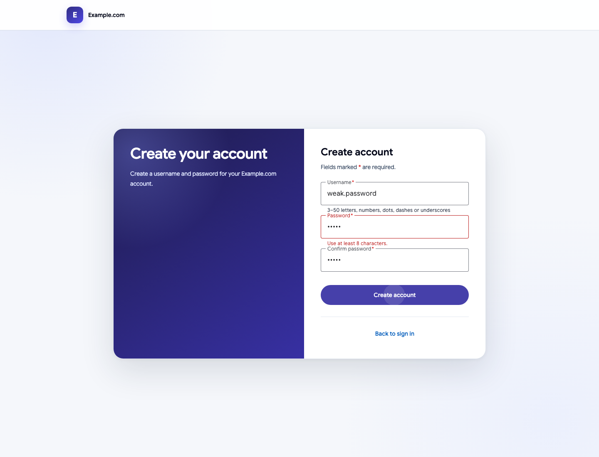

### TC-AUTH2-VAL-005 — API สมัครสมาชิกตอบ Problem Details เมื่อ payload ไม่ถูกต้อง

### SEC-AUTH2-001 — ปิดบังฟิลด์รหัสผ่านทุกช่อง

### SEC-AUTH2-002 — ปฏิเสธ API me เมื่อไม่มี JWT

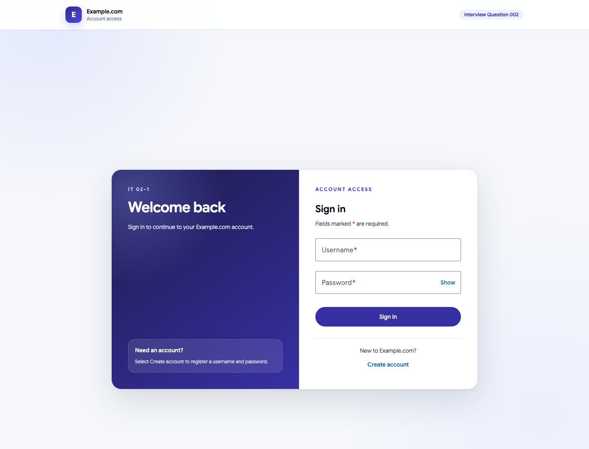

### SEC-AUTH2-006 — ปฏิเสธ JWT ไม่ถูกต้องและแจ้งให้เข้าสู่ระบบใหม่

### SEC-AUTH2-011 — ปฏิเสธ JWT ที่ถูกดัดแปลง

### SEC-AUTH2-003 — ใช้ข้อความกลางเมื่อข้อมูลรับรองผิด

### SEC-AUTH2-004 — ส่ง security headers ผ่าน Nginx

### SEC-AUTH2-013 — ไม่เปิดเผยรุ่นของ web server

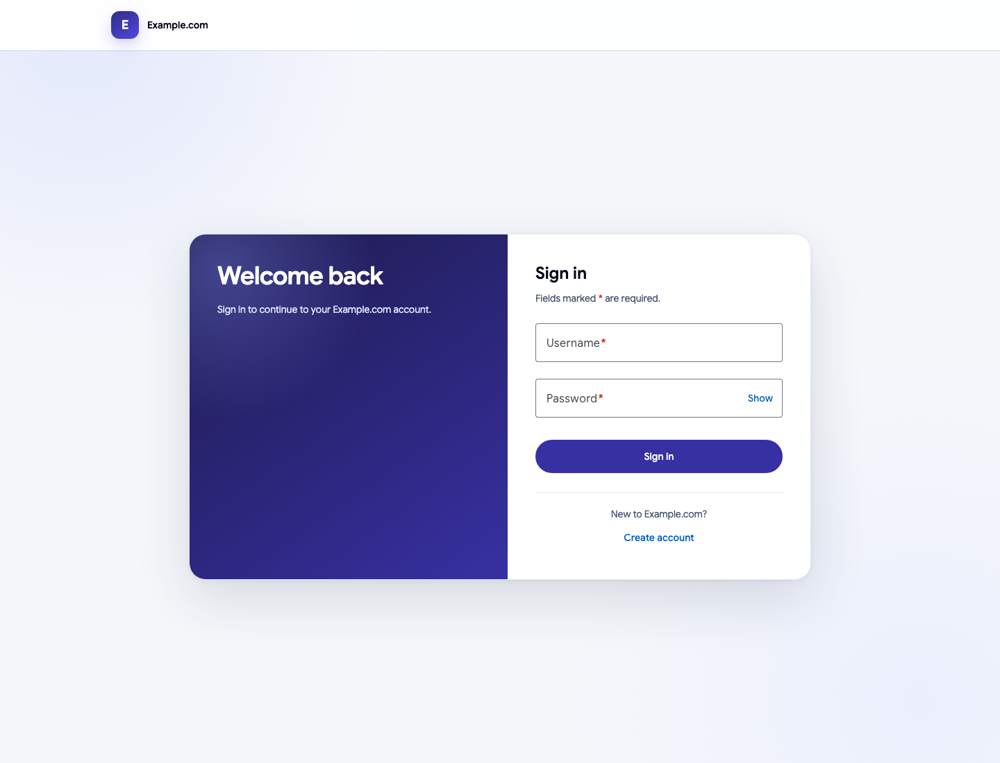

### TC-AUTH2-RESP-001 — ทุกหน้ารองรับ viewport มือถือ

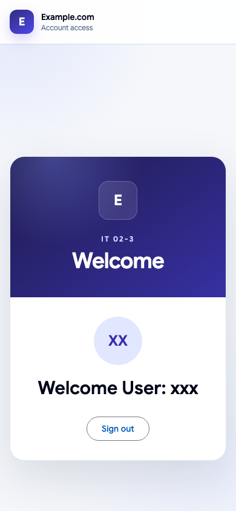

### TC-AUTH2-RESP-002 — การ์ด Login อยู่กึ่งกลางพื้นที่ใต้ส่วนหัว

### SEC-AUTH2-007 — ป้องกัน SQL injection ที่ช่อง Username ของ Login

### SEC-AUTH2-008 — ไม่อนุญาต CORS จาก origin ที่ไม่เชื่อถือ

### SEC-AUTH2-009 — ปฏิเสธ payload ที่เกินขนาดกำหนด

### SEC-AUTH2-010 — ไม่ cache ผลตอบกลับที่เกี่ยวกับการยืนยันตัวตน

### SEC-AUTH2-005 — จำกัดอัตราคำขอเข้าสู่ระบบ

### SEC-AUTH2-012 — จำกัดอัตราคำขอสมัครสมาชิก

## การสืบย้อน

- Test Step และผลที่คาดหวัง: `playwright-test-cases.md`
- รหัสในรายงานตรงกับ `src/client/e2e/authentication.spec.ts`
